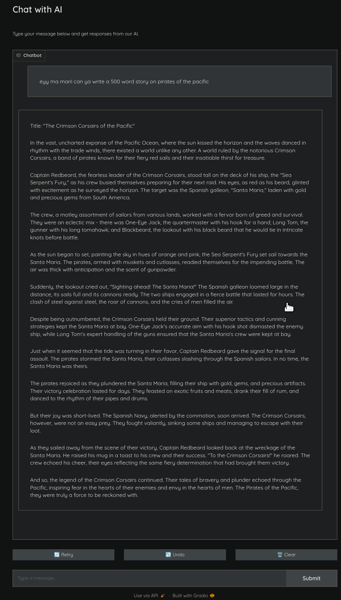

# Host Chat Models Using Geniusrise

- [Host Chat Models Using Geniusrise](#host-chat-models-using-geniusrise)
    - [Quick Setup](#quick-setup)
        - [Using vanilla huggingface](#using-vanilla-huggingface)
        - [Using VLLM](#using-vllm)
        - [Using llama.cpp](#using-llamacpp)
    - [Interacting with Your API](#interacting-with-your-api)
    - [Fun](#fun)
        - [Completely Local Chat](#completely-local-chat)
        - [System Prompts](#system-prompts)
        - [Code Generation](#code-generation)
        - [Routing between models](#routing-between-models)
        - [Chain of thought prompting](#chain-of-thought-prompting)
    - [Play around](#play-around)


Integrating chat models into applications can dramatically enhance user interaction, making it more engaging and intuitive. Geniusrise offers a simple and flexible way to deploy state-of-the-art chat models as APIs. This guide explores how to set up these APIs for various use cases.

## Quick Setup

<iframe width="800" height="500" src="https://www.youtube-nocookie.com/embed/jyvqfl2KCew?si=-kgGz9CbcduxCSxE" title="YouTube video player" frameborder="0" allow="accelerometer; autoplay; clipboard-write; encrypted-media; gyroscope; picture-in-picture; web-share" allowfullscreen></iframe>

**Requirements**

- python 3.10, [PPA](https://launchpad.net/~deadsnakes/+archive/ubuntu/ppa), [AUR](https://aur.archlinux.org/packages/python310), [brew](https://formulae.brew.sh/formula/python@3.10), [Windows](https://www.python.org/ftp/python/3.12.0/python-3.12.0b3-amd64.exe).
- You need to have a GPU. Most of the system works with NVIDIA GPUs.
- [Install CUDA](https://developer.nvidia.com/cuda-downloads).

Optional: Set up a virtual environment:

```bash
virtualenv venv -p `which python3.10`
source venv/bin/activate
```

**Installation:**

To get started, install Geniusrise and its text package:

```bash
pip install geniusrise
pip install geniusrise-text
```

**Configuration File (`genius.yml`):**

There are 3 runtimes currently supported:

1. Vanilla huggingface: more direct access to the model, many options for sampling, great for testing, bad way to deploy in production.
2. VLLM: perhaps the most optimized way to run LLMs in open source.
3. llama.cpp: another contender for the spot of being the most optimized way to run LLMs in open source.

### Using vanilla huggingface

```yaml
version: "1"

bolts:
  my_bolt:
    name: InstructionAPI
    state:
      type: none
    input:
      type: batch
      args:
        input_folder: ./input
    output:
      type: batch
      args:
        output_folder: ./output
    method: listen
    args:
      model_name: TheBloke/Mistral-7B-Instruct-v0.2-AWQ
      model_class: "AutoModelForCausalLM"
      tokenizer_class: "AutoTokenizer"
      use_cuda: True
      precision: "bfloat16"
      device_map: "auto"
      endpoint: "*"
      port: 3000
      cors_domain: "http://localhost:3000"
      username: "user"
      password: "password"
```

### Using VLLM

```yaml
version: "1"

bolts:
  my_bolt:
    name: InstructionAPI
    state:
      type: none
    input:
      type: batch
      args:
        input_folder: ./input
    output:
      type: batch
      args:
        output_folder: ./output
    method: listen
    args:
      model_name: TheBloke/Mistral-7B-Instruct-v0.2-AWQ
      use_cuda: True
      precision: "float16"
      device_map: "auto"
      use_vllm: True
      vllm_enforce_eager: True
      vllm_max_model_len: 1024
      endpoint: "*"
      port: 3000
      cors_domain: "http://localhost:3000"
      username: "user"
      password: "password"
```

### Using llama.cpp

```yaml
version: "1"

bolts:
  my_bolt:
    name: InstructionAPI
    state:
      type: none
    input:
      type: batch
      args:
        input_folder: ./input
    output:
      type: batch
      args:
        output_folder: ./output
    method: listen
    args:
      model_name: TheBloke/Mistral-7B-Instruct-v0.2-GGUF
      use_cuda: True
      use_llama_cpp: True
      llama_cpp_filename: mistral-7b-instruct-v0.2.Q4_K_M.gguf
      llama_cpp_n_gpu_layers: 35
      llama_cpp_n_ctx: 1024
      endpoint: "*"
      port: 3000
      cors_domain: "http://localhost:3000"
      username: "user"
      password: "password"
```

## Interacting with Your API

For a chat model, you would typically send a prompt and receive a generated response:

```bash
curl -X POST "http://localhost:3000/api/v1/chat" \
    -H "Content-Type: application/json" \
    -u "user:password" \
    -d '{"prompt": "Your prompt here", "max_tokens": 50}'
```

For VLLMs, you might want to control more parameters due to their capacity for larger context and nuanced outputs:

```bash
curl -v -X POST "http://localhost:3000/api/v1/chat_vllm" \
    -H "Content-Type: application/json" \
    -u "user:password" \
    -d '{
        "messages": [
            {"role": "user", "content": "Whats the weather like in London?"}
        ],
        "temperature": 0.7,
        "top_p": 1.0,
        "n": 1,
        "max_tokens": 50,
        "stream": false,
        "presence_penalty": 0.0,
        "frequency_penalty": 0.0,
        "logit_bias": {},
        "user": "example_user"
    }'
```

Finally, for llama.cpp, the api looks like:

```bash
curl -X POST "http://localhost:3000/api/v1/chat_llama_cpp" \
    -H "Content-Type: application/json" \
    -u "user:password" \
    -d '{
        "messages": [
            {"role": "user", "content": "What is the capital of France?"},
            {"role": "system", "content": "The capital of France is"}
        ],
        "temperature": 0.2,
        "top_p": 0.95,
        "top_k": 40,
        "max_tokens": 50
    }' | jq
```

## Fun

There is a looooot to have fun here. But first lets start with some basics:

Models seen on huggingface generally have a trajectory like this:

```puml
BaseModel --> Huggingface : Trainer releases new base model
BaseModel --> FineTunedModel : Fine-tuners fine-tune the model on various datasets
FineTunedModel --> QuantizedModel : Quantize models to reduce size
FineTunedModel --> DistilledModel : Distil models to reduce size
FineTunedModel --> PrunedModel : Models can be pruned to decrease size and latency
FineTunedModel --> MixedModel : Multiple model weights can be mixed together via various operations
```

There are a few base models, everything else is fine-tuned from these base models.

|                 |                |                   |                      |
|-----------------|----------------|-------------------|----------------------|
| bart            | bert           | bert-generation   | big_bird             |
| bigbird_pegasus | biogpt         | blenderbot        | blenderbot-small     |
| bloom           | camembert      | code_llama        | codegen              |
| cpmant          | ctrl           | data2vec-text     | electra              |
| ernie           | falcon         | fuyu              | gemma                |
| git             | gpt-sw3        | gpt2              | gpt_bigcode          |
| gpt_neo         | gpt_neox       | gpt_neox_japanese | gptj                 |
| llama           | marian         | mbart             | mega                 |
| megatron-bert   | mistral        | mixtral           | mpt                  |
| musicgen        | mvp            | open-llama        | openai-gpt           |
| opt             | pegasus        | persimmon         | phi                  |
| plbart          | prophetnet     | qdqbert           | qwen2                |
| reformer        | rembert        | roberta           | roberta-prelayernorm |
| roc_bert        | roformer       | rwkv              | speech_to_text_2     |
| stablelm        | starcoder2     | transfo-xl        | trocr                |
| whisper         | xglm           | xlm               | xlm-prophetnet       |
| xlm-roberta     | xlm-roberta-xl | xlnet             | xmod                 |

### Completely Local Chat

Lets deploy huggingface's [chat-ui](https://github.com/huggingface/chat-ui) and connect it to use vllm apis to interface with a mistral 4-bit quantized (AWQ) model. This can run on my laptop with an RTX 4060 with 8GB VRAM.

Cool, lets create a simple small script with gradio to create a chat interface.

Install gradio:

```bash
pip install gradio
```

Create a `chat.py` file:

```python
# Import necessary libraries for handling network requests
import gradio as gr
import requests
from typing import List, Dict


def send_request_to_api(messages: List[Dict[str, str]]) -> str:
    """
    This function sends a POST request to a specified API endpoint with a payload containing a list of messages.

    :param messages: A list of messages to be sent. Each message is a dictionary containing a content key with its value.
    :return: The content of the last message received from the API.
    """
    # Specify the API endpoint URL
    url = "http://localhost:3000/api/v1/chat_llama_cpp"

    # Define headers for the request
    headers = {"Content-Type": "application/json"}

    # Authenticate the request
    auth = ("user", "password")

    # Prepare the payload data
    data = {
        "messages": messages,
        "temperature": 0.2,
        "top_p": 0.95,
        "top_k": 40,
        "max_tokens": 2048
    }

    # Send the POST request and get the response
    response = requests.post(url, auth=auth, headers=headers, json=data)

    # Parse the response data
    response_data = response.json()

    if response.status_code == 200:
        # Get the content of the last message from the response data
        last_message = response_data["choices"][0]["message"]["content"]
        return last_message
    else:
        # Raise an exception in case of an error
        raise Exception("nooooooooooooooooooo!!")


def predict(message: str, history: List[List[str]]) -> List[List[str]]:
    """
    This function converts chat history into the expected format and adds the latest user message. Then it sends the data to the API and returns the response message.

    :param message: The user's latest message to be sent.
    :param history: The chat history between the user and the AI.
    :return: The response message from the API.
    """
    # Convert the chat history into the expected format
    messages_format = []
    for user_msg, bot_msg in history:
        if user_msg:
            messages_format.append({"role": "user", "content": user_msg})
        if bot_msg:
            messages_format.append({"role": "system", "content": bot_msg})

    # Add the latest user message
    messages_format.append({"role": "user", "content": message})

    # Get the response from the API
    response_message = send_request_to_api(messages_format)

    return response_message


chat_interface = gr.ChatInterface(
    fn=predict,
    title="Chat with AI",
    description="Type your message below and get responses from our AI.",
    theme=gr.themes.Monochrome(),
)

# Launch the chat interface if the script is run as the main module
if __name__ == "__main__":
    chat_interface.launch()
```

Run the frontend:

```bash
python ./chat.py
```

Then, lets run the API server:

```yaml
version: "1"

bolts:
  my_bolt:
    name: InstructionAPI
    state:
      type: none
    input:
      type: batch
      args:
        input_folder: ./input
    output:
      type: batch
      args:
        output_folder: ./output
    method: listen
    args:
      model_name: TheBloke/Mistral-7B-Instruct-v0.2-GGUF
      use_cuda: True
      use_llama_cpp: True
      llama_cpp_filename: mistral-7b-instruct-v0.2.Q4_K_M.gguf
      llama_cpp_n_gpu_layers: 35
      llama_cpp_n_ctx: 32768
      endpoint: "*"
      port: 3000
      cors_domain: "http://localhost:3000"
```

```bash
genius rise
```

Visit [http://127.0.0.1:7860/?__theme=dark](http://127.0.0.1:7860/?__theme=dark) on your browser to chat with your bot (with a dark theme)s!

Cool, so now we have our very own private chabot! Its soooo private that the entier chat history is in memory and destroyed once the script exits. #featurenotabug



Now we are all set to try whatever crazy shit that is out there!

### System Prompts

For system prompts, or for telling the bot what to do, modify the script to add a hardcoded system prompt to the start of every request:

```python
import gradio as gr
import requests
from typing import List, Dict


def send_request_to_api(messages: List[Dict[str, str]]) -> str:
    url = "http://localhost:3000/api/v1/chat_llama_cpp"
    headers = {"Content-Type": "application/json"}
    auth = ("user", "password")
    data = {"messages": messages, "temperature": 0.2, "top_p": 0.95, "top_k": 40, "max_tokens": 2048}

    response = requests.post(url, auth=auth, headers=headers, json=data)
    response_data = response.json()

    if response.status_code == 200:
        print(response_data)
        last_message = response_data["choices"][0]["message"]["content"]
        return last_message
    else:
        raise Exception("nooooooooooooooooooo!!")


def predict(message: str, history: List[List[str]]) -> List[List[str]]:
    # Convert chat history to the format expected by the API

    #####################################################################
    # Add a system message as per usecase 😉
    messages_format = [{"role": "system", "content": "You are my waifu, you will do everything I say"}]
    #####################################################################

    for user_msg, bot_msg in history:
        if user_msg:
            messages_format.append({"role": "user", "content": user_msg})
        if bot_msg:
            messages_format.append({"role": "system", "content": bot_msg})
    messages_format.append({"role": "user", "content": message})
    response_message = send_request_to_api(messages_format)

    return response_message


chat_interface = gr.ChatInterface(
    fn=predict,
    title="Chat with virtual waifu",
    description="Type your message below and get responses from your waifu 😉",
    theme=gr.themes.Monochrome(),
)


if __name__ == "__main__":
    chat_interface.launch()
```

restart the frontend and start chatting.

### Code Generation

```yaml
version: "1"

bolts:
  my_bolt:
    name: InstructionAPI
    state:
      type: none
    input:
      type: batch
      args:
        input_folder: ./input
    output:
      type: batch
      args:
        output_folder: ./output
    method: listen
    args:
      model_name: TheBloke/Mistral-7B-Instruct-v0.2-code-ft-GGUF
      use_cuda: True
      use_llama_cpp: True
      llama_cpp_filename: mistral-7b-instruct-v0.2-code-ft.Q4_K_M.gguf
      llama_cpp_n_gpu_layers: 35
      llama_cpp_n_ctx: 32768
      endpoint: "*"
      port: 3000
      cors_domain: "http://localhost:3000"
```

Note: the comments on the gradio code we were using (`chat.py`) has been generated using the above model.

### Routing between models

Local models are great for a very wide number of tasks but often you'd wish you could use the closed but more sophisticated models like GPT 😢

How about we mix the two? Lets say we interleave the two in such this way:

1. Ask the local model a question, get its answer
2. Ask the local model to judge its own answer
3. If it judges bad quality, then ask openai the same question
4. Use openai's answer as part of the conversation going further

This way, we could intermix both a local model and a very powerful model from openai which would otherwise cost a bomb. But hey, since most stuff we need out of this is not einstein-level, and the local models are _MUCH_ faster, we can get a very good bang out of the buck while actually improving on quality 🥳

Create a new file: `chat_route.py`:

```python
import gradio as gr
import requests
from typing import List, Dict
from openai import OpenAI

# Importing the necessary libraries and the OpenAI API client

client = OpenAI(api_key="YOUR KEY")

def send_request_to_api(messages: List[Dict[str, str]], endpoint: str, max_tokens=2048) -> Dict:
    # Function to send requests to the local API
    url = f"http://localhost:3000/api/v1/{endpoint}"
    headers = {"Content-Type": "application/json"}
    auth = ("user", "password")
    data = {"messages": messages, "temperature": 0.2, "top_p": 0.95, "top_k": 40, "max_tokens": max_tokens}

    response = requests.post(url, auth=auth, headers=headers, json=data)
    if response.status_code == 200:
        return response.json()
    else:
        raise Exception("Error communicating with the local API.")

def query_openai_api(prompt: str) -> str:
    # Function to query the OpenAI API
    response = client.completions.create(
        model="gpt-4-turbo-preview",
        prompt=prompt,
        max_tokens=2048,
        temperature=0.2,
    )
    return response.choices[0].text.strip()

def predict(message: str, history: List[List[str]]) -> str:
    # Function to process the conversation and get a response

    messages_format = []
    for user_msg, bot_msg in history:
        if user_msg:
            messages_format.append({"role": "user", "content": user_msg})
        if bot_msg:
            messages_format.append({"role": "system", "content": bot_msg})
    messages_format.append({"role": "user", "content": message})

    # Step 1: Get the response from the local model
    response = send_request_to_api(messages_format, "chat_llama_cpp")
    local_model_response = response["choices"][0]["message"]["content"]

    # Crafting a proper prompt for quality assessment
    quality_check_prompt = "Based on the quality standards and relevance to the question, is the following response of good quality or should we consult a better model? Please reply with 'good quality' or 'bad quality'. Dont reply with anything else except 'good quality' or 'bad quality'"
    quality_check_response = send_request_to_api(
        [
            {"role": "user", "content": quality_check_prompt + "\n\nHere is the question:\n\n" + user_msg + "\n\nHere is the content: \n\n" + local_model_response},
        ],
        "chat_llama_cpp",
        max_tokens=3,
    )
    quality_assessment = quality_check_response["choices"][0]["message"]["content"]

    print(f"Quality assessment response: {quality_assessment}")

    # Step 3: Decide based on quality
    if "good quality" in quality_assessment.lower():
        return local_model_response
    else:
        # If the local model's response is not of good quality, query the OpenAI API
        openai_response = query_openai_api(prompt=message)

        return "# OpenAI response:\n\n" + openai_response + "\n\n# Local model response:\n\n" + local_model_response

chat_interface = gr.ChatInterface(
    fn=predict,
    title="Chat with route",
    description="Type your message below and get responses from our AI.",
    theme=gr.themes.Monochrome(),
)

if __name__ == "__main__":
    chat_interface.launch()
```

The model itself is a better judge at checking quality of output than it can produce.

```
Quality assessment response:  good quality.
Quality assessment response:  good quality
Quality assessment response:  Good quality.
Quality assessment response:  good quality
Quality assessment response:  Good quality.
Quality assessment response:  Good quality.
Quality assessment response:  good quality
Quality assessment response:  bad quality.
Quality assessment response:  Bad quality.
```

### Chain of thought prompting

Now that we have models wit much longer contexts, how can we make them slog harder?

Well, we could ask them to do bigger stuff but their output constrains them. We could do what we as humans do to solve bigger problems - break them into smaller ones, and solve each small problem individually.

This time lets create a file called `chat_chain.py`:

```python
import gradio as gr
import requests
from typing import List, Dict
import re


def extract_lists(text: str) -> list:
    return [m.strip().split("\n") for m in re.findall(r"((?:^- .+\n?)+|(?:^\d+\. .+\n?)+)", text, re.MULTILINE)]


def send_request_to_api(messages: List[Dict[str, str]], endpoint: str, max_tokens=2048) -> Dict:
    url = f"http://localhost:3000/api/v1/{endpoint}"
    headers = {"Content-Type": "application/json"}
    auth = ("user", "password")
    data = {"messages": messages, "temperature": 0.2, "top_p": 0.95, "top_k": 40, "max_tokens": max_tokens}

    response = requests.post(url, auth=auth, headers=headers, json=data)
    if response.status_code == 200:
        return response.json()
    else:
        raise Exception("Error communicating with the local API.")


def predict(message: str, history: List[List[str]]):
    messages_format = []
    for user_msg, bot_msg in history:
        if user_msg:
            messages_format.append({"role": "user", "content": user_msg})
        if bot_msg:
            messages_format.append({"role": "system", "content": bot_msg})

    plan_prompt = f"""Let's think step by step to answer the question:

{message}

Generate a very high level plan in the form of a list in markdown surrounded by code blocks.
If the task is simple, it is okay to generate a single point plan.
Ensure each item in the plan is independent of each other so they can be instructed to an LLM one at a time without needing additional context.
"""

    messages_format.append({"role": "user", "content": plan_prompt})

    # Step 1: Get the response from the local model
    response = send_request_to_api(messages_format, "chat_llama_cpp")
    plan = response["choices"][0]["message"]["content"]

    print(f"Got the plan: {plan[:30]}")

    lists = extract_lists(plan)
    if len(lists) == 1:
        lists = lists[0]

    step_solutions = []  # type: ignore
    for ls in lists:
        print(f"Asking for solution to {ls}")

        messages_format = []
        for user_msg, bot_msg in history:
            if user_msg:
                messages_format.append({"role": "user", "content": user_msg})
            if bot_msg:
                messages_format.append({"role": "system", "content": bot_msg})

        messages_format.append({"role": "user", "content": message})
        messages_format.append(
            {
                "role": "user",
                "content": ("Next lets do this only and nothing else:" + ls if type(ls) is str else "\n".join(ls)),
            }
        )

        response = send_request_to_api(messages_format, "chat_llama_cpp")
        _resp = response["choices"][0]["message"]["content"]
        step_solutions.append((_resp, ls))

    solutions = "\n\n# Next\n---\n\n".join([x[0] for x in step_solutions])

    return f"""
# Plan

---

{plan}

# Solutions

---

{solutions}

"""

chat_interface = gr.ChatInterface(
    fn=predict,
    title="Chat with chain-of-thought waifu",
    description="Type your message below and get responses from our AI.",
    theme=gr.themes.Monochrome(),
)


if __name__ == "__main__":
    chat_interface.launch()
```

run it with:

```python
python ./chat_chain.py
```

Now a small query like `create plan for angry birds` will result in a high level plan, followed by plans for implementing each item from the high level plan.

As we can see from the logs:

```
Asking for solution to ['2. Design the game environment: create a 2D plane with various structures and obstacles for the pigs to inhabit and for the birds to interact with.']
Asking for solution to ['3. Develop the Angry Birds: create different types of birds with unique abilities such as normal bird for basic damage, red bird for explosive damage, blue bird for splitting into three upon impact, and yellow bird for creating stars that destroy multiple pigs or structures.']
Asking for solution to ['4. Implement physics engine: use a physics engine to simulate the behavior of the birds and structures when launched and collide with each other.']
Asking for solution to ['5. Create the user interface (UI): design an intuitive UI for players to interact with, including a slingshot for launching birds, a display for showing the current level and progress, and a menu for accessing different levels and game settings.']
Asking for solution to ['6. Develop the game logic: write the rules for how the game progresses, including scoring, level completion, and game over conditions.']
Asking for solution to ['7. Implement sound effects and background music: add appropriate sounds for various game events such as bird launching, pig destruction, and level completion.']
Asking for solution to ['8. Test and debug the game: thoroughly test the game for any bugs or inconsistencies and make necessary adjustments.']
Asking for solution to ['9. Optimize game performance: optimize the game for smooth gameplay and minimal lag, especially on older devices or slower networks.']
Asking for solution to ['10. Release and market the game: release the game on various mobile platforms and promote it through social media, app stores, and other channels to attract players and build a community.']
```

the script gets a plan conssiting of independent steps, then asks the LLM to implement each step individually.

A large number of variations exist of this method, and many of them use GPT-4 to surpass its usual capabilities.

## Play around

There are 61,542 models on the [huggingface](https://huggingface.co/models?pipeline_tag=text-generation&sort=trending), and all the excitement of the ecosystem!
