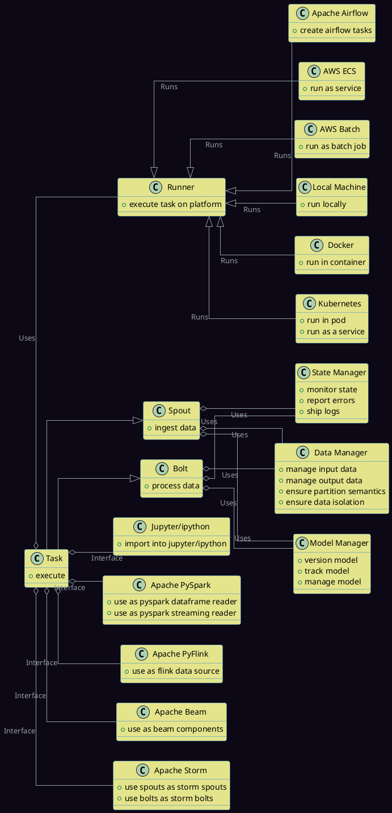
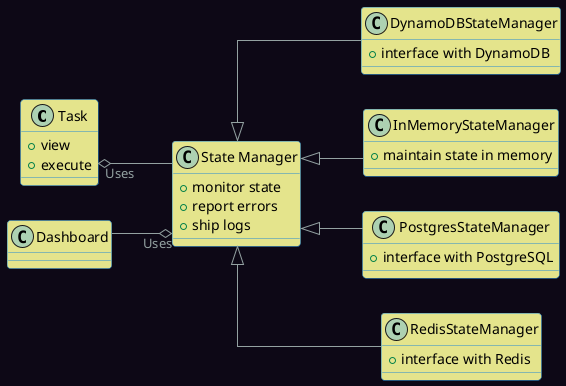
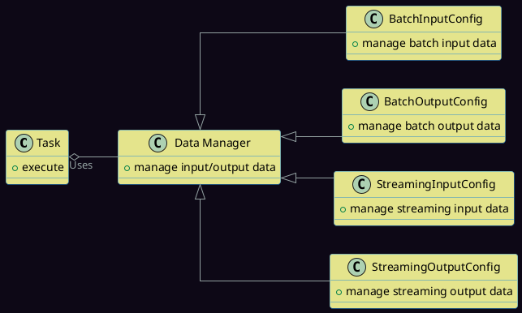
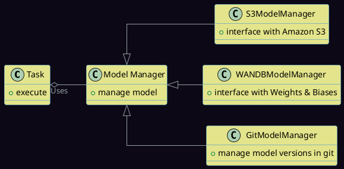
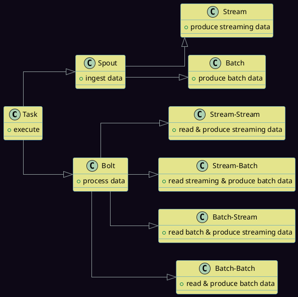

# Architecture

## Introduction

---

The Geniusrise framework is designed to provide a modular, scalable, and interoperable system for orchestrating machine learning workflows, particularly in the context of Large Language Models (LLMs). The architecture is built around the core concept of a `Task`, which represents a discrete unit of work. This document provides an overview of the architecture, detailing the primary components and their interactions.

## System Overview

---

The Geniusrise framework is composed of several key components:

1. **Tasks**: The fundamental units of work.
2. **State Managers**: Responsible for monitoring and managing the state of tasks.
3. **Data Managers**: Oversee the input and output data associated with tasks.
4. **Model Managers**: Handle model operations, ensuring efficient management.
5. **Runners**: Wrappers for executing tasks on various platforms.
6. **Spouts and Bolts**: Specialized tasks for data ingestion and processing.

## Tasks

---

A **task** is the fundamental unit of work in the Geniusrise framework. It represents a specific operation or computation and can run for an arbitrary amount of time, performing any amount of work.

## State Managers

---

**State Managers** play a pivotal role in maintaining the state of tasks. They ensure that the progress and status of tasks are tracked, especially in distributed environments. Geniusrise offers various types of State Managers:

1. **DynamoDBStateManager**: Interfaces with Amazon DynamoDB.
2. **InMemoryStateManager**: Maintains state within the application's memory.
3. **PostgresStateManager**: Interfaces with PostgreSQL databases.
4. **RedisStateManager**: Interfaces with Redis in-memory data structure store.

State Managers store data in various locations, allowing organizations to connect dashboards to these storage systems for real-time monitoring and analytics. This centralized storage and reporting mechanism ensures that stakeholders have a unified view of task states.

## Data Managers

---

**Data Managers** are responsible for handling the input and output data for tasks. They implement various data operations methods that tasks can leverage to ingest or save data during their runs. Data Managers can be categorized based on their function and data processing type:

1. **BatchInputConfig**: Manages batch input data.
- **BatchOutputConfig**: Manages batch output data.
- **StreamingInputConfig**: Manages streaming input data.
- **StreamingOutputConfig**: Manages streaming output data.

Data Managers manage data partitioning for both batch and streaming data. By adhering to common data patterns, they enable the system's components to operate independently, fostering the creation of intricate networks of tasks. This independence, while allowing for flexibility and scalability, ensures that cascading failures in one component don't necessarily compromise the entire system.

## Model Managers

---

**Model Managers** oversee model operations, ensuring that models are saved, loaded, and managed. They can be of two primary types:

1. **S3ModelManager**: Interfaces with Amazon S3 for model storage.
2. **WANDBModelManager**: Interfaces with Weights & Biases for model versioning.
3. **GitModelManager**: Interfaces with Git repositories for versioning of models.

## Spouts and Bolts

---

At the heart of the Geniusrise framework are two primary component types: **spouts** and **bolts**.

1. **Spouts**: These are tasks responsible for ingesting data from various sources. Depending on the output type, spouts can either produce streaming output or batch output.
    1. **Batch**: Runs periodically, Produces data as a batch output.
    2. **Stream**: Runs forever, produces data into a streaming output.

- **Bolts**: Bolts are tasks that take in data, process it, and produce output. They can be categorized based on their input and output types:
    1. **Stream-Stream**: Reads streaming data and produces streaming output.
    - **Stream-Batch**: Reads streaming data and produces batch output.
    - **Batch-Stream**: Reads batch data and produces streaming output.
    - **Batch-Batch**: Reads batch data and produces batch output.

## Runners

Runners are the backbone of the Geniusrise framework, ensuring that tasks are executed seamlessly across various platforms. They encapsulate the environment and resources required for task execution, abstracting away the underlying complexities. Geniusrise offers the following runners:

1. **Local Runner**: Executes tasks directly on a local machine, ideal for development and testing.
- **Docker Runner**: Runs tasks within Docker containers, ensuring a consistent and isolated environment.
- **Kubernetes Runner**: Deploys tasks on Kubernetes clusters, leveraging its scalability and orchestration capabilities.
- **Airflow Runner**: Integrates with Apache Airflow, allowing for complex workflow orchestration and scheduling.
- **ECS Runner**: Executes tasks on AWS ECS, providing a managed container service.
- **Batch Runner**: Optimized for batch computing workloads on platforms like AWS Batch.

