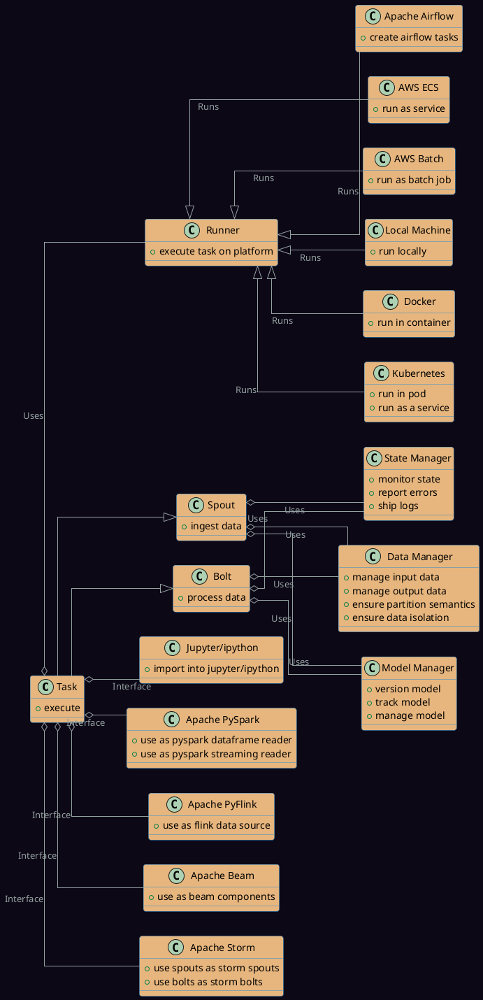
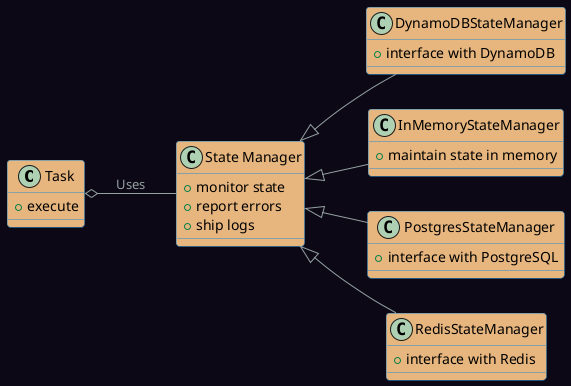
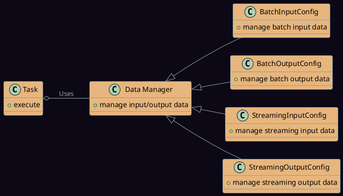
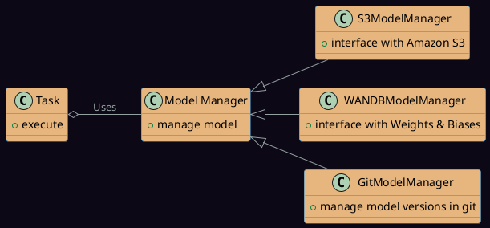
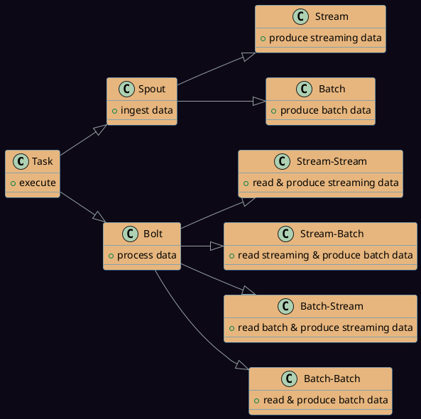

# Concepts

## Need

---

The landscape of machine learning and data processing has been rapidly evolving. While there are numerous solutions available for MLOps and DAG orchestration, most of them cater primarily to data engineering and data science teams. However, the rise of Large Language Models (LLMs) is reshaping this landscape, necessitating a more inclusive approach to MLOps.

LLMs have democratized the use of machine learning models, enabling a broader spectrum of users within an organization to engage with them. This means that even organizations without a traditional data science data management or model management functions are now venturing into this domain.

This shift brings forth several challenges:

1. **Infrastructure Complexity**: The world of MLOps is vast, with a plethora of options available for different use cases. Organizations often grapple with questions like:
    - Which infrastructure is best suited for their needs?
    - How can they efficiently reuse their existing infrastructure?
    - How can they ensure scalability and performance while managing costs?

2. **Diverse Competence Levels**: As LLM workflows become more prevalent, their volume is set to surpass that of traditional ML workflows in many organizations. This surge means that individuals without a formal engineering background or core ML expertise will be involved in the MLOps process. Ensuring that these individuals can contribute effectively without compromising the quality or integrity of the workflows is crucial.

3. **Standardization and Productionization**: While many aspects of building LLM workflows can be managed without deep engineering expertise, there's a critical need for standardization. Engineers play a pivotal role in defining the processes for productionizing these workflows. Without standardized practices:
    - How can organizations ensure consistency across workflows?
    - How can they maintain the reliability and robustness of deployed models?
    - How can they ensure that best practices are adhered to, regardless of who is building or deploying the workflow?

The advent of LLMs underscores the need for a comprehensive MLOps framework that caters to a diverse audience. Such a framework should be flexible enough to accommodate the varied infrastructure needs of organizations, inclusive enough to empower contributors regardless of their technical expertise, and robust enough to ensure standardized, reliable workflows.

## Introduction

---

In the ever-evolving landscape of software development, the need for modular, scalable, and interoperable systems has never been greater. The Geniusrise framework is a testament to this philosophy, designed to act as a cohesive adhesive between distinct, modular components, much like how one would piece together Lego blocks. This design approach not only promotes flexibility but also ensures that each module or "Lego block" remains sufficiently independent. Such independence is crucial for diverse teams, each with its own unique infrastructure and requirements, to seamlessly build and manage their respective components.

In brief these are the concepts:

1. **Task**: At its core, a task represents a discrete unit of work within the Geniusrise framework. Think of it as a singular action or operation that the system needs to execute. A task further manifests itself into a Bolt or a Spout as stated below.

2. **Components of a Task**: Each task is equipped with four components:
    1. **State Manager**: This component is responsible for continuously monitoring and managing the task's state, ensuring that it progresses smoothly from initiation to completion and to report errors and ship logs into a central location.
    2. **Data Manager**: As the name suggests, the Data Manager oversees the input and output data associated with a task, ensuring data integrity and efficient data flow. It also ensures data sanity follows partition semantics and isolation.
    3. **Model Manager**: In the realm of machine learning, model versioning and management are paramount. The Model Manager serves as a GitOps tool for ML models, ensuring that they are versioned, tracked, and managed effectively.
    4. **Runner**: These are wrappers for executing a task on various platforms. Depending on the platform, the runner ensures that the task is executed seamlessly.

3. **Task Classification**: Tasks within the Geniusrise framework can be broadly classified into two categories:
    - **Spout**: If a task's primary function is to ingest or bring in data, it's termed as a 'spout'.
    - **Bolt**: For tasks that don't primarily ingest data but perform other operations, they are termed 'bolts'.

The beauty of the Geniusrise framework lies in its adaptability. Developers can script their workflow components once and have the freedom to deploy them across various platforms. To facilitate this, Geniusrise offers:

1. **Runners for Task Execution**: Geniusrise is equipped with a diverse set of runners, each tailored for different platforms, ensuring that tasks can be executed almost anywhere:
    1. On your **local machine** for quick testing and development.
    2. Within **Docker containers** for isolated, reproducible environments.
    3. On **Kubernetes** clusters for scalable, cloud-native deployments.
    4. Using **Apache Airflow** for complex workflow orchestration.
    5. On **AWS ECS** for containerized application management.
    6. With **AWS Batch** for efficient batch computing workloads.

2. **Library Wrappers**: To ensure that tasks can interface with a variety of frameworks, Geniusrise provides integrations with:
    1. **Jupyter/ipython** for interactive computing.
    2. **Apache PySpark** for large-scale data processing.
    3. **Apache PyFlink** for stream and batch processing.
    4. **Apache Beam** for unified stream and batch data processing.
    5. **Apache Storm** for real-time computation.

The framework aims to support multiple languages:

1. Python
2. Scala / JVM (WIP)
3. Golang (WIP)

This document delves into the core components and concepts that make up the Geniusrise framework.

## Tasks

---

A **task** is the fundamental unit of work in the Geniusrise framework. It represents a specific operation or computation and can run for an arbitrary amount of time, performing any amount of work.

## State Managers

---

**State Managers** play a pivotal role in maintaining the state of tasks. They ensure that the progress and status of tasks are tracked, especially in distributed environments. Geniusrise offers various types of State Managers:

1. **DynamoDBStateManager**: Interfaces with Amazon DynamoDB.
2. **InMemoryStateManager**: Maintains state within the application's memory.
3. **PostgresStateManager**: Interfaces with PostgreSQL databases.
4. **RedisStateManager**: Interfaces with Redis in-memory data structure store.

State Managers store data in various locations, allowing organizations to connect dashboards to these storage systems for real-time monitoring and analytics. This centralized storage and reporting mechanism ensures that stakeholders have a unified view of task states.

## Data Managers

---

**Data Managers** are responsible for handling the input and output data for tasks. They implement various data operations methods that tasks can leverage to ingest or save data during their runs. Data Managers can be categorized based on their function and data processing type:

- **BatchInputConfig**: Manages batch input data.
- **BatchOutputConfig**: Manages batch output data.
- **StreamingInputConfig**: Manages streaming input data.
- **StreamingOutputConfig**: Manages streaming output data.

Data Managers play a crucial role in managing data partitioning for both batch and streaming data. By adhering to common data patterns, they enable the system's components to operate independently, fostering the creation of intricate networks of tasks. This independence, while allowing for flexibility and scalability, ensures that cascading failures in one component don't necessarily compromise the entire system.

## Model Managers

---

**Model Managers** oversee model operations, ensuring that models are saved, loaded, and managed efficiently. They can be of two primary types:

1. **S3ModelManager**: Interfaces with Amazon S3 for model storage.
2. **WANDBModelManager**: Interfaces with Weights & Biases for model versioning.
3. **GitModelManager**: Interfaces with Git repositories for versioning of models.

## Spouts and Bolts

---

At the heart of the Geniusrise framework are two primary component types: **spouts** and **bolts**.

- **Spouts**: These are tasks responsible for ingesting data from various sources. Depending on the output type, spouts can either produce streaming output or batch output.

- **Bolts**: Bolts are tasks that take in data, process it, and produce output. They can be categorized based on their input and output types:
  - Stream-Stream: Reads streaming data and produces streaming output.
  - Stream-Batch: Reads streaming data and produces batch output.
  - Batch-Stream: Reads batch data and produces streaming output.
  - Batch-Batch: Reads batch data and produces batch output.

## Runners

Runners are the backbone of the Geniusrise framework, ensuring that tasks are executed seamlessly across various platforms. They encapsulate the environment and resources required for task execution, abstracting away the underlying complexities. Geniusrise offers a diverse set of runners:

1. Local Runner: Executes tasks directly on a local machine, ideal for development and testing.
- Docker Runner: Runs tasks within Docker containers, ensuring a consistent and isolated environment.
- Kubernetes Runner: Deploys tasks on Kubernetes clusters, leveraging its scalability and orchestration capabilities.
- Airflow Runner: Integrates with Apache Airflow, allowing for complex workflow orchestration and scheduling.
- ECS Runner: Executes tasks on AWS ECS, providing a managed container service.
- Batch Runner: Optimized for batch computing workloads on platforms like AWS Batch.

## Tradeoffs

Because of the very loose coupling of the components, though the framework can be used to build very complex networks with independently running nodes, it provides limited orchestration capability, like synchronous pipelines. An external orchestrator like airflow can be used in such cases to orchestrate geniusrise components.
