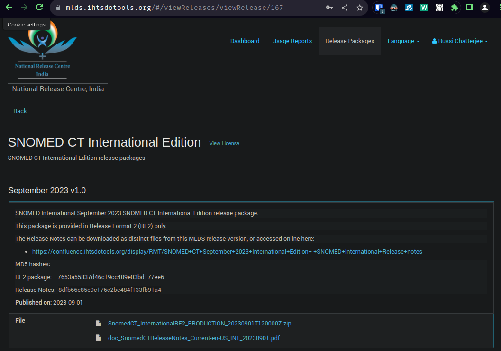

# Dev Cycle

This document describes one full local development cycle.

Lets say we want to build a pipeline which tags medical terms in EHR documents.

## Strategies

Pre-requisites:

1. SNOMED-CT: is a knowledge graph of standard medical terminology
2. IHTSDO: a standards body for medical terminologies in a number of countries.
3. UMLS: unified medical language system is a set of files and software that brings together many health and biomedical vocabularies and standards together.

### Strategy 1: Named entity recognition

#### 1. Create a labelled dataset

We need a corpus of documents with medical terms labeled. For example, we could use wikipedia + wikidata to build such a dataset, given entities in wikipedia are linked and indexed in the wikidata knowledge graph. Reference: [Building a Massive Corpus for Named Entity Recognition using Free Open Data Sources](https://arxiv.org/pdf/1908.05758.pdf). We could also annotate medical datasets like [MIMIC-III](https://physionet.org/content/mimiciii/1.4/) annotated with SNOMED-CT based [MedCAT](https://github.com/CogStack/MedCAT) which is a medical annotation tool developed on the knowledge graph of medical terminology (SNOMED-CT), as it would be more pertinent to our usecase, reference: [DNER Clinical (named entity recognition) from free clinical text to Snomed-CT concept](https://www.wseas.org/multimedia/journals/computers/2017/a205805-078.pdf)

#### 2. Train a model on the NER dataset

We could choose a large language model and train the model on the NER fine-tuning task. The model would then be able to recognize and tag medical terms in any given text data.

### Strategy 2: Vector knowledge graph search

#### 1. Create a vectorized knowledge graph

We use an LLM to create a vectorized layer over SNOMED-CT. This layer can be used to semantically search for "seed" nodes in the graph. We can then use these seed nodes to traverse nodes a few hops adjacent to the seed nodes.

#### 2. Retrieval Augmented NER

We use the knowledge graph search results to not only annotate each node seen in the EHR document, but also add additional information about those nodes derived from its adjacent nodes. But first, we also need to make sure that we query the right information instead of simply vectorized chunks and throwing it at semantic search. We would need a "traditional" pipeline for this - lemmatization followed by POS tagging. We use both proper nouns and out of vocabulary words as search query terms.

## Boilerplate

To setup a local geniusrise project, simply use the geniusrise project creator script:

```bash
curl -L https://geniusrise.new | bash
```

## Existing project

If you wish to add geniusrise to an existing project:

```bash
pip install geniusrise
pip freeze > requirements.txt
```

## From scratch

Here is how to set up from scratch:

```python
#!/bin/bash

# Prompt for project details
read -p "Enter your project name: " project_name
read -p "Enter your name: " author_name
read -p "Enter your email: " author_email
read -p "Enter your GitHub username: " github_username
read -p "Enter a brief description of your project: " project_description

# Create project structure
mkdir $project_name
cd $project_name
mkdir $project_name tests

# Create basic files
touch README.md
touch requirements.txt
touch setup.py
touch Makefile
touch $project_name/__init__.py
touch tests/__init__.py

# Populate README.md
echo "# $project_name" > README.md
echo "\n$project_description" >> README.md

# Populate setup.py
cat <<EOL > setup.py
from setuptools import setup, find_packages

with open("README.md", "r", encoding="utf-8") as fh:
    long_description = fh.read()

setup(
    name='$project_name',
    version='0.1.0',
    packages=find_packages(exclude=["tests", "tests.*"]),
    install_requires=[],
    python_requires='>=3.10',
    author='$author_name',
    author_email='$author_email',
    description='$project_description',
    long_description=long_description,
    long_description_content_type='text/markdown',
    url='https://github.com/$github_username/$project_name',
    classifiers=[
        'Programming Language :: Python :: 3',
        'License :: OSI Approved :: MIT License',
        'Operating System :: OS Independent',
    ],
)
EOL

# Populate Makefile
cat <<EOL > Makefile
setup:
	@pip install -r ./requirements.txt

test:
	@coverage run -m pytest -v ./tests

publish:
	@python setup.py sdist bdist_wheel
	@twine upload dist/$project_name-\$${VERSION}-* --verbose
EOL

# Set up the virtual environment and install necessary packages
virtualenv venv -p `which python3.10`
source venv/bin/activate
pip install twine setuptools pytest coverage geniusrise
pip freeze > requirements.txt

# Fetch .pre-commit-config.yaml and .gitignore from geniusrise/geniusrise
curl -O https://raw.githubusercontent.com/geniusrise/geniusrise/master/.pre-commit-config.yaml
curl -O https://raw.githubusercontent.com/geniusrise/geniusrise/master/.gitignore

echo "Project $project_name initialized!"
```

Create a install script out of this and execute it:

```bash
touch install.sh
chmod +x ./install.sh
./install.sh
```

## Preparing the knowledge graph

Lets prepare the knowledge graph by vectorizing each node's knowledge into a vectorized flat memory. This is a periodic activity that one needs to do whenever a new version of SNOMED-CT is released (typically bi-annually).

We use the international version of SNOMED-CT from [https://www.nlm.nih.gov/healthit/snomedct/international.html](https://www.nlm.nih.gov/healthit/snomedct/international.html).


```bash
mkdir data
cd data
```

Go to [UMLS](https://www.nlm.nih.gov/research/umls/licensedcontent/umlsknowledgesources.html) or [IHTSDO](https://mlds.ihtsdotools.org/) website, register, agree to the agreements and after approval, download the knowledge graph.



Unzip the file

```bash
unzip SnomedCT_InternationalRF2_PRODUCTION_20230901T120000Z.zip
```

