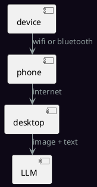

# Bulding an AI pin

Lets do an end to end project where we build an AI-pin to talk to a multi-modal language model.

The system consists of two parts:

1. Device: A low-power network device with camera, speaker and microphone
2. Desktop: A central machine hosting the LLM, possibly a desktop computer running geniusrise

We start with a ESP32 based platform as there are many these days. Lets look at two of them:

## TTGO

The TTGO T-Camera Plus is a unique ESP32 module featuring a built-in camera and display. It's designed for applications that require direct image capture and display capabilities without the need for external screens or cameras.

- CPU: Dual-core Tensilica LX6 microprocessor up to 240 MHz
- Memory: 520 KB SRAM, 4 MB PSRAM
- Connectivity: Wi-Fi (802.11 b/g/n), Bluetooth (Classic and BLE)
- Camera: OV2640 camera module, 2 Megapixels
- Display: 1.3-inch OLED display
- Extras: Fish-eye lens, optional MPU6050 module for motion sensing

## Seeed Studio XIAO

Seeed Studio XIAO ESP32C3 is a mini but powerful module. It's part of the Seeed Studio XIAO series, known for its compact design and reliability in various IoT projects.

- CPU: RISC-V single-core processor, up to 160 MHz
- Memory: 400 KB SRAM, 4 MB Flash
- Connectivity: Wi-Fi (802.11 b/g/n), Bluetooth 5 (LE)
- I/O Pins: Rich set of peripherals including GPIOs, UART, SPI, I2C, and more.
- Size: Ultra-small form factor suitable for wearable devices and compact projects

## Peripherals

We used a bunch of these peripherals wherever the boards did not have them. We usually chose a platform with at least a screen and a camera included and added these peripherals to them.

### Microphone

- Model: INMP441 I2S
- Features: High precision, omnidirectional, MEMS microphone module, Digital I2S interface
- Usage: Ideal for high-quality audio input and voice command projects

[product-page](https://robu.in/product/inmp441-mems-high-precision-omnidirectional-microphone-module-i2s/).

### Speaker

- Model: SeeedStudio Grove Speaker
- Features: Programmable, with built-in amplifier, capable of playing various tones and sounds
- Usage: Suitable for projects requiring audio output like alarms, voice notifications, and music playback

[product-page](https://wiki.seeedstudio.com/Grove-Speaker/)

### Touchscreen

- Model: SeeedStudio Round Display for XIAO
- Features: Touchscreen capability, round display, perfect for user interface projects
- Usage: Excellent for compact and wearable devices requiring user interaction

[product-page](https://robu.in/product/seeed-studio-round-display-for-xiao-touch-screen/)

## Connections

Now lets get connected. The following lists all connections, some soldering of headers may be required.

### Seeed Studio XIAO Connections

For the Seeed Studio XIAO, we'll connect a touchscreen display, an INMP441 I2S microphone, and a SeeedStudio Grove Speaker.

#### Touchscreen Display

- **Display Model:** Seeed Studio Round Display for XIAO
- **Connection Type:** SPI
- **Required Pins:**
  - **SCL (Serial Clock)** to XIAO's SCL (GPIO18 for SPI clock)
  - **SDA (Serial Data)** to XIAO's SDA (GPIO19 for SPI MOSI)
  - **RES (Reset)** to any available GPIO pin (e.g., GPIO21) for display reset
  - **DC (Data/Command)** to any available GPIO pin (e.g., GPIO22) for data/command selection
  - **CS (Chip Select)** to any available GPIO pin (e.g., GPIO5) for SPI chip select

Very easy to connect, xiao sits on the display.

#### Microphone (INMP441 I2S)

- **Connection Type:** I2S
- **Required Pins:**
  - **WS (Word Select/LRCLK)** to GPIO23
  - **SCK (Serial Clock)** to GPIO18
  - **SD (Serial Data)** to GPIO19

#### Speaker (SeeedStudio Grove)

- **Connection Type:** Digital I/O
- **Required Pins:**
  - **SIG** to any PWM-capable GPIO pin (e.g., GPIO25) for audio signal
  - **GND** to GND

### TTGO T-Camera Plus Connections

For the TTGO T-Camera Plus, we're connecting an INMP441 I2S microphone and a SeeedStudio Grove Speaker since it already includes a camera and display.

#### Microphone (INMP441 I2S)

- **Connection Type:** I2S
- **Required Pins:**
  - **WS (Word Select/LRCLK)** to GPIO32
  - **SCK (Serial Clock)** to GPIO14
  - **SD (Serial Data)** to GPIO27

#### Speaker (SeeedStudio Grove)

- **Connection Type:** Digital I/O
- **Required Pins:**
  - **SIG** to any PWM-capable GPIO pin (e.g., GPIO33) for audio signal
  - **GND** to GND

### General Tips

- **Power Supply:** Ensure that all devices are powered appropriately. The XIAO and TTGO can be powered via USB or an external 3.3V power supply.
- **Common Ground:** Make sure all components share a common ground connection.
- **Programming:** Use the Arduino IDE or ESP-IDF for programming the ESP32 devices. Libraries specific to the peripherals (e.g., display, I2S microphone, and speaker) will be required.
- **I2S Library:** For the INMP441 microphone, an I2S library suitable for ESP32 should be used to handle audio input.
- **Display Library:** For the touchscreen display, a library compatible with the specific model will be needed for interfacing and graphics rendering.
